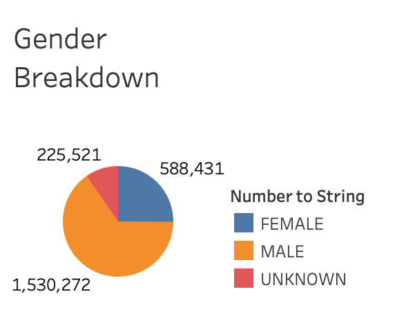

# bikesharing

## Overview of the analysis: Explain the purpose of this analysis.
We have created this analysis to visualize Des Moines bike-sharing data to share with stakeholders. This way, all stakeholders are properly informed of bike usage and revenue data. Visualizations were created and arranged on Tableau.

[link to dashboard](https://public.tableau.com/profile/dorna.abdi#!/vizhome/Module14Challenge_16181970568090/BikeStory?publish=yes)

## Results: Using the visualizations you have in your Tableau Story, describe the results of each visualization underneath the image.

Below, you can see first of many visualizations. This one shows the length of time that bikes are checked out for all riders. You can see in this image that most bike rentals peak between 0 and 20 minutes of rental and trend downward from there.   
           

Next, you will see similar data but arranged by gender (male, female, and unknown). The same overall trend is depicted. However, one can see the uneven gender distribution of renters. The peak of renters around 10 minutes in was over 100,000 men but that same peak was closer to 30,000 female renters. The peak of unknown geners lingered around 4,000 rentals.   
           

This next visualization is a heatmap that plots the number of bike trips by weekday by each hour of the day. The darker the color, the highere the usage. Therefore, the highest volume of bike trips in the weekday is around rush hour: 7-9 AM and 4-7pm.   
           

Next, there is a similar heatmap that shows trip volume on weekdays but this one is divided up by gender. The same trends aare visible but depicted more intensely in the male category.   
           

This next heatmap takes the analysis one step further. It plots the number of bike trips by gender for each hour of every day of the week and stratifies the data based on customer use versus subscriber use. There is high user density for male subscribers of the bike-sharing service compared to all other categories. This is true for every day of the week.   
           

Seeing how there is a huge gender disparity, I also wanted to see the distribution of bike riders by gender. On this pie chart below, you can see that over 1.5 million users are men while there are only 588,431 female user and 225,521 unknown users.   
           

Lastly, while trip volume is important, it is also important to visualize trip locations by mapping out starting location of bike users, regardless of anything else. It's clear that most riders are condensed right in the middle of the island.   
      

## Summary
To summarize, bike sharing is a lucrative service but the users and the usage is distributed very unevenly. More men rent out bikes and the most popular times align with rush hour in the mornings and at night.   

### Additional Graphs
1. First, I would recommend visuallizing the relationship between ride duration and start/end location. This way, stakeholders can identify the most high-leverage locations to invest in. 
2. Next, I would recommend visualizing average revenue per bike ride to calculate profits. 

